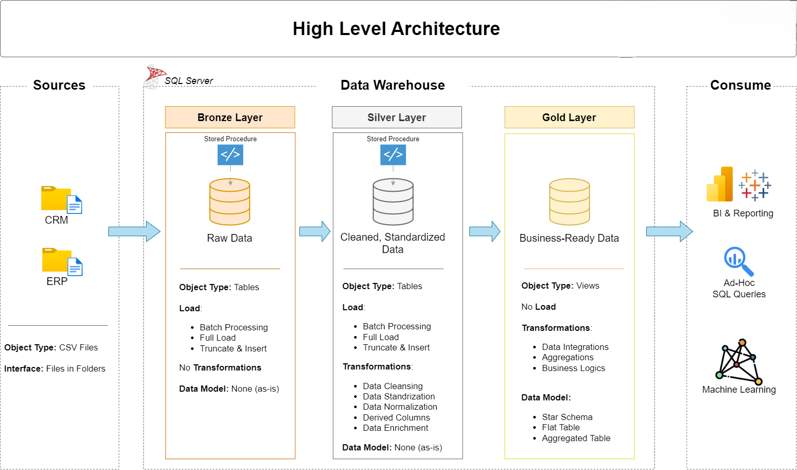

# SQL Data Warehouse Project

This project demonstrates the development of a modern **data warehouse** using **SQL Server**, built on top of real-world data integration challenges. It simulates pulling raw operational data from ERP and CRM systems, applying end-to-end **ETL pipelines**, and modeling that data into a **star schema** for business analytics and reporting.

---

## 🔧 Project Objective

To build a scalable, modular, and analytics-ready SQL-based data warehouse using:
- CRM and ERP data sources
- Medallion Architecture (Bronze → Silver → Gold)
- SQL-based ETL processing
- Dimensional modeling with fact and dimension tables

---

## 🧱 Architecture Overview

The data warehouse is structured using the **Medallion Architecture**:

- **Bronze Layer (Raw Data)**  
  Loads raw CSV files into SQL Server staging tables. No transformations applied — retains full source fidelity for traceability and recovery.

- **Silver Layer (Cleansed & Integrated)**  
  Data is standardized, deduplicated, and integrated across systems (CRM and ERP). This includes handling nulls, casting types, resolving lookup values, and joining related entities.

- **Gold Layer (Business-Ready)**  
  Final data is modeled into a **star schema** structure, with `fact_sales` at the center and supporting dimension tables (`dim_customers`, `dim_products`, etc.). This layer powers ad-hoc queries, reporting, and dashboarding.

---

## 🔄 Data Integration Strategy

The source systems contain:
- **CRM**: Sales transactions, product history, and customer profiles
- **ERP**: Product categories, extended customer demographics, and geographic details

Using consistent keys (`prd_key`, `cst_id`, `cid`), data from both systems is joined and enriched to produce a complete customer and product view. This unified data feeds into the Gold Layer.

---

## ⚙️ ETL Workflow

All ETL processes are implemented using **T-SQL**:

- **Bronze Scripts**: Load CSV files into raw staging tables using `TRUNCATE + INSERT`.
- **Silver Scripts**: Apply joins, mapping, deduplication, cleansing, and transformations. Each domain (customers, products, sales) is processed modularly.
- **Gold Scripts**: Create surrogate keys, build dimension tables, and load the central `fact_sales` table using lookup joins and referential constraints.

The pipeline is designed to be modular, testable, and reproducible — aligned with best practices in data engineering.

---

## 📐 Dimensional Modeling (Star Schema)

The final warehouse model includes:
- `fact_sales`: Order transactions, dates, amounts, quantity, and references to all dimensions.
- `dim_customers`: Customer info enriched with ERP demographics (birthdate, gender, country, etc.).
- `dim_products`: Product hierarchy, category, maintenance status, and metadata.

This structure enables efficient slicing across multiple dimensions and supports downstream BI tools for visualization and KPI reporting.

---

## 🧪 Data Quality Measures

To ensure data reliability, the following checks are built into the transformation process:
- Primary key constraints and surrogate key generation
- No duplicate sales records
- Null checks on critical fields (e.g., product/customer keys)
- Referential integrity between fact and dimension tables

---

## 📊 Business Insights Enabled

The final warehouse supports analytics use cases such as:
- Total sales by product, region, and sales rep
- Product category and subcategory performance
- Customer segmentation by geography and behavior
- Sales trends over time using the date dimension

This structure enables fast querying, supports Power BI/Tableau integrations, and allows data analysts to create dynamic dashboards from modeled data.

---

## 🛠 Tools Used

- **SQL Server Express** — Database engine for staging, transformations, and modeling  
- **SQL Server Management Studio (SSMS)** — Scripting and execution  
- **T-SQL** — Data manipulation and pipeline logic  
- **ERP / CRM CSV Files** — Raw datasets (flat files)
